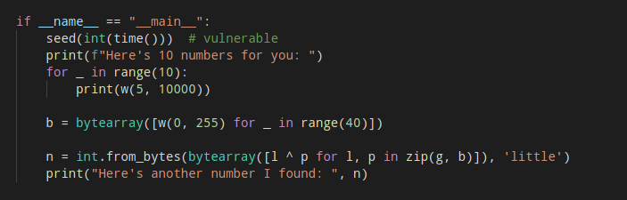
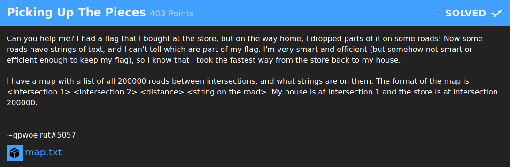
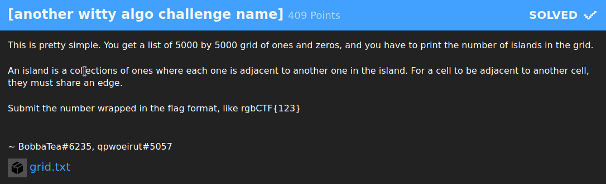

## Mở đầu

Cuối tuần vừa rồi mình khá là rảnh, tính kiếm gì chơi nên mới mò vào giải CTF này, mình vào phần prizes thì thấy có trao thưởng hộp mứt (ngon :3) nên mình quyết định cắm chuột vào chơi thôi.

Vì đây là giải CTF đầu tiên mình chơi nên rank cũng không được cao lắm và cũng chả được hộp mứt nào, khá là buồn :<<


## Table of Contents
    + [**{BEGINER} Simple RSA**](#wu1)
    + [**{CRYPTO} e**](#wu2)
    + [**{CRYPTO} Occasionally Tested Protocol**](#wu3)
    + [**{MISC} Picking Up The Pieces**](#wu4)
    + [**{MISC} [another witty algo challenge name]**](#wu5)


<a name="wu1"></a>

## {BEGINER} Simple RSA

Đề bài rất đơn giản, cho 2 files, 1 file `.py` chứa implementation của thuật toán RSA và file còn lại chứa 3 số `n, e, c`. Chúng ta phải decode đoạn cipher text `c` để lấy được plain text cũng chính là flag.

![] (../ctf/rgbCTF/img/Screenshot_20200715_074336.png)

Dễ dàng nhận thấy `n` ở đây không quá lớn (length < `256 bit`) nên mình nghĩ ngay đến việc phân tích `n` ngược lại thành `p` và `q`. Việc này dễ dàng thực hiện được bằng các công cụ online như [factordb](http://factordb.com/) hay [alpertron](https://www.alpertron.com.ar/ECM.HTM).

Sau khi tìm được `p` và `q`, mình ráp chúng vào đoạn python cho sẵn, tìm được `d`.

```python
p = 255097177
q = 22034393943473183756163118460342519430053
n = p * q
e = 65537
lmbd = lcm(p - 1, q - 1)
d = mod_inverse(e, lmbd)
```

Có `c`, `d` và `n` rồi, việc còn lại là tìm plain text ở dạng số bằng công thức `m = c ^ d (mod n)`.

```python
c = 1415060907955076984980255543080831671725408472748
m = pow(c, d, n)
```

Tuy nhiên plain text đang ở dạng số nên mình vẫn chứ thấy được chữ gì @@, tiếp theo là hàm chuyển số thành chữ thôi :>

```python
def int_to_bytes(x: int) -> bytes:
    return x.to_bytes((x.bit_length() + 7) // 8, 'little')
```

Tại sao lại là `(bitlength + 7) // 8`? Vì param đầu tiên của hàm `int.to_bytes()` là độ dài của chuỗi sau khi decrypt, 1 kí tự được biểu diễn bằng `8 bits`, mà `00000001` cũng biểu diễn 1 kí tự nhưng độ dài bit lại bằng 1 (những bit 0 ở đầu không có nghĩa đều bị bỏ đi). `1 // 8 == 0` => không có kí tự nào sau khi decrypt, vậy là dở rồi :v.

Mình cần phải cộng thêm một lượng vừa đủ để không bị dư cũng như không bị thiếu. Chính là số 7, vì 7 chính là số lượng bit 0 lúc nãy bị bỏ đi ở đầu.

`(0 + 7) // 8 == 0` khi độ dài bit bằng 0 thì dộ dài bằng 0 (thỏa mãn)
`(1 + 7) // 8 == 1` khi ------------- = 1 thì --------- = 1 (vẫn thỏa mãn)
`(8 + 7) // 8 == 1` khi ------------- = 8 thì --------- = 1 (như trên)

b00m, nguyên liệu đã xong, việc còn lại là bỏ hết vào và xào nấu thôi =))

```python
from sympy import mod_inverse
from math import gcd

def int_to_bytes(x: int) -> bytes:
    return x.to_bytes((x.bit_length() + 7) // 8, 'little')

def lcm(a: int, b: int) -> int:
    return a * b // gcd(a, b)

p = 255097177
q = 22034393943473183756163118460342519430053
n = p * q
e = 65537
lmbd = lcm(p - 1, q - 1)
d = mod_inverse(e, lmbd)

c = 1415060907955076984980255543080831671725408472748
m = pow(c, d, n)
print(int_to_bytes(m))
```


<a name="wu2"></a>

## {CRYPTO} e

Bài này lại là một bài về RSA, người ta cho ba số `n`,`e` và `c`. Mình cần phải decrypt `c` để tìm được flag.


Mình quan sát thấy `e` khá là nhỏ, `e = 13`


Do e nhỏ, `c << n` mà `c = m^e (mod n)` suy ra phép modulo không làm ảnh hưởng đến `c` ban đầu. Do đó `m = c ^ (1/e)`.
Để tính chính xác căn bậc `e` của `c` thì mình dùng hàm `iroot()` trong thư viện `gmpy2`

```python
import gmpy2

def int_to_bytes(x: int) -> bytes:
    return x.to_bytes((x.bit_length() + 7) // 8, 'little')

e = 0b1101
c = 0x6003a15ff3f9bc74fcc48dc0f5fc59c31cb84df2424c9311d94cb40570eeaa78e0f8fc2917addd1afc8e5810b2e80a95019c88c4ee74849777eb9d0ee27ab80d3528c6f3f95a37d1581f9b3cd8976904c42f8613ee79cf8c94074ede9f034b61433f1fef835f2a0a45663ec4a0facedc068f6fa2b534c9c7a2f4789c699c2dcd952ed82180a6de00a51904c2df74eb73996845842276d5523c66800034351204b921d4780180ca646421c61033017e4986d9f6a892ed649c4fd40d4cf5b4faf0befb1e2098ee33b8bea461a8626dd8cd2eed05ccd471700e2a1b99ed347660cbd0f202212f6c0d7ad8ef6f878d887af0cd0429c417c9f7dd64890146b91152ea0c30637ce503635018fd2caf436a12378e5892992b8ec563f0988fc0cebd2926662d4604b8393fb2000

m, _ = gmpy2.iroot(c, e)
print(int_to_bytes(int(m)))
```


<a name="wu3"></a>

## {CRYPTO} Occasionally Tested Protocol

Ở đây, người ta encrypt flag với một chuỗi `random`. Do đó, mỗi lần kết nối đến server mình sẽ nhận được một cipher text khác nhau.

Bản chất của hàm `random` là nhận vào một giá trị, giá trị đó được gọi là `seed`. Sau đó hàm `random` bắt đầu sinh ra các số ngẫu nhiên dựa trên giá trị của `seed`. Vậy nếu `seed` giống nhau thì các số ngẫu nhiên được sinh ra bởi hàm `random` là giống nhau.

Mình lướt sơ qua thì nhận thấy `seed` ở đây được lấy từ hàm `time()` tức là lấy thời gian lúc đoạn code được thực thi.



Do seed là thời gian được lấy từ hàm `time()` và thời gian hiện tại so với thời gian trên server chênh lệch nhau không quá nhiều nên mình có thể bruteforces được giá trị của `seed` một cách nhanh chóng.

```python
print(f"Here's 10 numbers for you: ")
for _ in range(10):
    print(w(5, 10000))
```

Để kiểm tra `seed` mình bruteforces được có phải là `seed` đã được dùng để encrypt flag hay không cũng không có gì khó. Đoạn code trên in ra cho mình 10 số ngẫu nhiên, nếu cùng một `seed` thì tất nhiên 10 số sinh ngẫu nhiên của mình và 10 số này sẽ phải giống nhau, mình chỉ cần sinh ngẫu nhiên 10 số rồi kiểm tra xem chúng có giống nhau hay không là được :3.

Đây là solution của mình:

```python
from pwn import remote
from time import time
from random import seed, randint as w

start_time = int(time())

r = remote('challenge.rgbsec.xyz', 12345)
r.recvline()
arr = [ int(r.recvline()) for i in range(10) ]
cipher = int(r.recvline()[31:])
r.close()

end_time = int(time())

for t in range(start_time - 1000, end_time + 1000):
    seed(t)
    newarr = [ w(5, 10000) for _ in range(10) ]
    if newarr != arr:
        continue
    g = cipher.to_bytes((cipher.bit_length() + 7) // 8, 'little')
    b = bytearray([w(0, 255) for _ in range(40)])
    for i in range(len(g)):
        print(chr(g[i] ^ b[i]), end='')
    break

```


<a name="wu4"></a>

## {MISC} Picking Up The Pieces



Bài này họ yêu cầu tìm đường đi ngắn nhất giữa nhà và cửa hàng. Coi bản đồ là một đồ thị có hướng và đường đi giữa hai địa điểm là hai chiều. Áp dụng `Dijkstra` mình dễ dàng tìm được flag của bài này.

Bài này mình viết bằng `c++`. Đồ thị được biểu diễn bằng danh sách kề.
Gọi `u` là `intersection 1`, `v` là `intersection 2`, `w` là `distance`, `s` là `string on the road`. Với mỗi con đường mình tạo 2 cạnh ngược chiều nhau với cùng một trọng số và chuỗi s: `u -> v : (w, s)` và `v -> u : (w, s)`

```cpp
	freopen("map.txt", "r", stdin);
	for (int i = 1; i <= n; ++i) {
		int u, v, w;
		string s;
		cin >> u >> v >> w >> s;
		near[u].emplace_back(edge({v, w, s}));
		near[v].emplace_back(edge({u, w, s}));
	}
```

Sau đó áp dụng thuật toán `Dijkstra` để tìm đường đi ngắn nhất giữa nhà và cửa hàng, mỗi khi cập nhật độ dài đường đi ngắn nhất của một đỉnh thì lưu lại truy vết để xí nữa truy vết ngược lại tìm flag. Mình kết hợp `Dijkstra` với `Binary Heap` để tối ưu về tốc độ.

```cpp
	for (int i = 2; i <= n; ++i) // d[i] độ dài đường đi ngắn nhất từ nhà đến đỉnh i, ban đầu chưa biết nên mình để là một số rất lớn
		d[i] = 1e18;  // d[0] = 0 tức độ dài đường đi ngắn nhất từ nhà về nhà = 0, tất nhiên rồi :3
	heap.emplace(1);  
	while (!heap.empty()) {
		int u = heap.top();
		heap.pop();
		if (u == n)  // Khi đi tới cửa hàng thì dừng luôn, khỏi bàn cãi :v
			break;
		for (edge &t: near[u]) {
			int v = t.v, w = t.w;
			if (d[v] > d[u] + w) {  // Nếu độ dài đường đi ngắn nhất từ 0 đến đỉnh u cộng độ dài cạnh (u, v) 
				d[v] = d[u] + w;	// ngắn hơn độ dài đường đi ngắn nhất từ 0 đến đỉnh v thì cập nhật d[v]
				heap.emplace(v);
				trace[v] = {u, t.s};  // Gán truy vết của v bằng u kèm với chuỗi s
			}
		}
	}
```

Source code: [map_sol.cpp](../ctf/rgbCTF-2020/map_sol.cpp)


<a name="wu5"></a>

## {MISC} [another witty algo challenge name]

[insert ez emoji]. Bài này là một bài đồ thị cơ bản, mình code chưa đến 5' là xong :3. 



Người ta cho 1 files `.txt` gồm một bảng kích thước 5000x5000 bao gồm các số 0 và 1. Yêu cầu tìm số lượng hòn đảo trên bảng. Tập hợp các ô chứa số 1 nằm kề nhau được gọi là đảo.

Coi bảng các ô vuông là một đồ thị, hai đỉnh có cạnh nối là hai ô kề nhau trong bảng. Dùng thuật toán DFS để đếm số lượng thành phần liên thông, đây cũng chính là flag cần tìm.

Source code: [grid_sol.cpp](../ctf/rgbCTF/grid_sol.cpp)

## Hết òi, hong còn gì nữa đâu mà kéo :3 